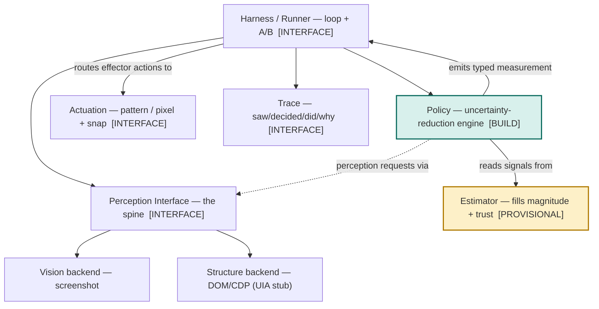

# Vision-Primary Computer-Use Agent — Consolidated Spec

**What this is.** The settled architecture, stated as the destination. Buildable from cold, readable in one pass. It replaces the need to read the derivation docs to understand the system. The reasoning record (how each decision was reached, including rejected branches) lives in the companion captures — see *Derivation record* at the end.

**Dual register.** Confident about the *reasoning*, honest about the *unknowns*. Where a thing is settled it is stated plainly; where a thing is unproven it is flagged. Do not read the confident tone as "measured."

**Depth labels.** Each module is marked:
- `[BUILD]` — specified to build depth, code can be written against it.
- `[INTERFACE]` — contract/seam defined, internals deferred.
- `[PROVISIONAL]` — openly unsolved; the honest floor of the system.

---

## 1. Thesis

Per step, the agent chooses the **lowest-cost measurement** that brings its **calibrated risk of acting wrong** below the bar set by **stakes** and **support**. If risk cannot be calibrated because the step is out of support, it **escalates**.

Three consequences define the system:
- **Vision is primary.** The model perceives and plans from pixels. Structure (DOM/UIA) is a probe called *for precision, disambiguation, or confirmation* — not an always-on layer.
- **Eyes-then-hands is a consequence, not a rule.** Looking is a cheaper measurement than acting; the agent takes the cheapest measurement that clears the block first.
- **Measurement is one family.** Look, probe, wait, and act are measurements with different cost and information. **Acting is the highest-cost measurement** — it changes the world. Value-of-information is the native shape, not a patch.

**Three triggers** govern the choice: confidence `c`, stakes `k`, support `s`.

---

## 2. System architecture

Five modules behind one perception interface. Each has a single reason to change.

**Invariants of the wiring:**
- The agent **never knows** whether it faces a live target or a replay — both are perception backends.
- The policy emits **typed measurements**; the harness routes them. The policy calls nothing directly (pure, testable).
- Automatic perception (ambient glance) and deliberate perception (probe) go through **one** perception interface. The policy decides *timing*; it is not two code paths.
- The full-look baseline is the **same policy with the probe-trigger forced on** — a flag, not a second codebase.

---

## 3. Perception interface `[INTERFACE]` — the spine

The most important line in the system. The agent asks for an observation or an action result; a backend satisfies it.

- **Two backends, one interface.** Vision (screenshot) and structure (DOM via CDP now; UIA as a stubbed backend). The interface is written to admit both; one structure backend is implemented, the other noted as future work.
- **Observation contract:** a vision observation (image + scaled-coordinate space) and, on request, a structure observation (elements with identity, role, exact bounds, enabled/offscreen flags). Structure may return **empty** (canvas / no tree) — a valid answer the policy must handle.
- **Live vs replay are backends, not rewrites.** Real Computer Use API calls in the live backend; recorded screenshots/DOM snapshots in the replay backend. The seam makes this swappable.

---

## 4. Policy layer `[BUILD]` — uncertainty-reduction engine

The module the architecture is built to make legible. A **pure function**: `(observation, belief) → (typed measurement, belief')`. It computes no signals; it combines them.

### 4.1 Belief = a model of what is *not* known
Foreground is a **typed uncertainty profile**; background is a thin state estimate (just enough to specify actions). The atom of the belief is a **triple**:

| Field | Meaning |
|---|---|
| **magnitude** | how uncertain — a real number (e.g. P(wrong) about this aspect) |
| **trust** | how much to believe that magnitude (provenance / support for *this* estimate) |
| **reducer** | the measurement that would lower it (look / probe / wait / act) |

Belief = a set of triples (one per active uncertainty type) + the state estimate.

### 4.2 Uncertainty types → measurements

| Uncertainty | Reduced by |
|---|---|
| State (what screen / did it change) | look |
| Location (where exactly) | probe |
| Readiness (has it settled) | wait |
| Outcome (what if I commit) | act (highest cost) |
| **Support (is my estimate trustworthy)** | **nothing on-screen → escalate** |

Support is **not a separate trigger** — it is the `trust` field per entry; global support is their aggregate. Escalation fires when trust is weak across the board and no measurement can strengthen it.

### 4.3 The decision (the pure function)
Scan the triples → for each compute a **blocking weight** (how much it blocks a confident commit), weighted by `trust` → pick the most-blocking → emit its `reducer`. If the blocker is low-trust everywhere → **escalate**. Acting is emitted only when no cheaper measurement would change the decision.

### 4.4 Graduation — carry a number, trust it only when earned
The policy reads **magnitude and trust together**:
- **weak trust →** use magnitude **ordinally** (sort, pick biggest). No fine-grained math on an unearned number.
- **strong trust →** use magnitude **quantitatively** (real VOI against the stakes bar).

Same representation, same code; behavior graduates as the estimator earns it, driven by the `trust` field — **not a rewrite**. A number (not an ordinal) because it ports to code and stays comparable; the representation never changes.

### 4.5 Belief update
A measurement returns → **debit** the uncertainties it reduced, **credit** any it raised (a look lowers State but may raise Location), **log** what moved. The update is an isolated named step inside the policy's boundary (policy owns its picture; update logic stays inspectable).

### 4.6 Stakes enters by a separate door
Stakes is **not** from the soft estimator. It is a conservative read on the action type, erring high — a confirm/delete/submit is high-stakes by classification. The one safety-critical signal stays out of the noisy channel; its false-negative rate on destructive actions must be near zero.

### 4.7 Output is a measurement (not act/perceive/halt)
One output type: a decision to measure the blocking uncertainty. "Act," "probe," "wait," "escalate" are all *which measurement* — they are not separate branches in the contract.

### 4.8 Resolution scope (decided: coarse)
The policy resolves **one** blocking uncertainty per step. Legible and testable. The rich alternative (reason over the whole profile at once) is **deferred**; reopen it only if real runs show oscillation, wasted measurement, or deadlock — all of which are readable in the update history, not external instrumentation.

---

## 5. Estimator `[PROVISIONAL]` — the honest floor

Fills the `magnitude` and `trust` fields the policy consumes. **This is the load-bearing unknown of the entire system.** Whether a cheap, external signal predicts being-wrong well enough to trigger on is unproven.

- **Inputs (candidates):** plan instability across resamples (the model proposes different actions when the same screen is sampled N times), frame-diff magnitude, out-of-support density. **Logprobs / token-level confidence are foreclosed** — the Anthropic Computer Use API exposes no per-token probabilities (verified live 2026-06-27), so sample disagreement is the cheap signal, not logprobs (cost: N calls per estimate). Design: `05_estimator_spec.md`.
- **Starts crude, improves.** Begins at the ordinal/heuristic end; graduates toward calibrated probability as data accrues. The policy does not change as it improves.
- **External, not introspective.** The model need not *know* it is uncertain; the estimator reads hesitation from outside — **sample disagreement across resamples** (logprobs are unavailable on this API). Introspective self-report alone is assumed too weak.
- **Where debugging time goes.** Once magnitude is a real number, scrutiny moves here. The policy reads clean; every hard question ("is 0.3 right, is this trust justified") lands on this module. That concentration is intentional.

---

## 6. Actuation `[INTERFACE]`

- **Pattern-first, pixel fallback.** Actuate by structural pattern (invoke/toggle/setvalue/select) when available; else synthetic click at the element center.
- **Snap-to-target reconciliation.** The model points at a region; if a structural marker is near, snap to its center and prefer its pattern; else click the raw pixel. Vision stays authoritative; structure sharpens. Degrades to pure pixels when no structure exists.
- **Authority split:** vision owns semantic intent; structure can be authoritative for interactability (enabled / focus / offscreen / role) **when corroborated**.

---

## 7. Trace `[INTERFACE]`

Per step, the readable record: **saw / decided / did**, plus **why I reached** on any probe step. This is the demo's legibility surface and, expanded, the harness's logging contract. The full per-step schema (provider context, frame hash + sampled frame, intended action/target/expected/stakes/reversibility, signals incl. support, tool calls + latency/tokens/evidence, reconciliation, post-action result, oracle label, failure labels, counterfactuals) is the harness-grade version, deferred with the measurement layer.

---

## 8. Harness / runner `[INTERFACE]`

- Wires the modules; runs the loop.
- **A/B is the convincer:** the same task two ways — blended vs **full-look-every-step** — side by side, reporting steps, latency, tokens, and where structure saved a step or avoided a misclick.
- The baseline is the **policy with probe forced on**, not separate code.

---

## 9. Demo scope (v0)

**Artifact form:** code that is *read*, not a live performance. Optimize for legibility of the architecture, not live reliability.

**In:** one recognizable knowledge-worker task; the eyes-then-hands loop with one earned probe; the readable trace; the A/B against full-look; one visible "I don't know → escalate/flag" moment.

**Out (deferred to the measurement layer):** regime space, occupancy geometry, proxy learning, oracle calibration, basis-adequacy tests, the full VOI math. These are the answer to *"how would you make this reliable,"* which is the question that follows the demo.

**Target:** Power Automate (cloud or desktop) for the narrative — the successor automating the predecessor — with a Windows-settings dialog as the clean fallback. Because the artifact is read, not run, live-fragility risk is low and the cheeky framing is pure upside.

**The kill question (the bar everything serves):**
> Can this policy beat "full look every step" on cost while matching or improving confident-wrong rate? Until yes, the rest is scaffolding around an unproven savings claim.

---

## 10. Load-bearing unknowns (the honest floor)

Stated so they do not calcify into assumed-true.

1. **Cheap external uncertainty exists** — that **sample disagreement** (resample-the-screen plan instability) predicts being-wrong better than chance, cheaply, per step. Logprobs would be the cheaper signal, but the Computer Use API exposes none (verified 2026-06-27), so the cheap path rests entirely on sample disagreement at **N model calls per estimate** — which raises the bar on the savings claim. *If false, the cheap path dies and the system is stakes-only (works, but not much cheaper than always-look).* This is #1.
2. **Support emerges as second-order uncertainty / per-entry trust** — currently a **design hypothesis, not a demonstrated property.** If it holds, it is the strongest argument in the policy; if not, §4.2 needs softening.
3. **Screens are static between actions** — the cheap-measurement economics assume this; heavy SPAs (e.g. the PA maker portal) are the likeliest to violate it.
4. **The basis is adequate** — that coverage/dynamics/stakes are coordinates that can even *see* the structure that drives wrongness. Untestable absolutely; falsifiable via predictive sufficiency.

**Operational response to all four:** ignorance detection (escalate when out of support) plus measurement before trust. No analysis removes the generalization gap; the system contains it by detecting OOD and handing off.

---

## 11. Derivation record

How each decision was reached, including rejected branches and the adversarial review:
- `perception_policy_spec.md` — full reasoning chain, the decision tree, the measurement-layer design (§17–§20), the review folds (§21).
- `policy_layer_spec.md` — the uncertainty-reduction reframe, the belief-triple seam, coarse-vs-rich with return triggers.
- `v0_demo_slice_spec.md` — the demo scoping and task selection.
- `uia_snapshot.py` — the structure-probe skeleton (set-of-marks, snap-to-target, pattern actuation).

This consolidated spec is the destination; those are the path.
